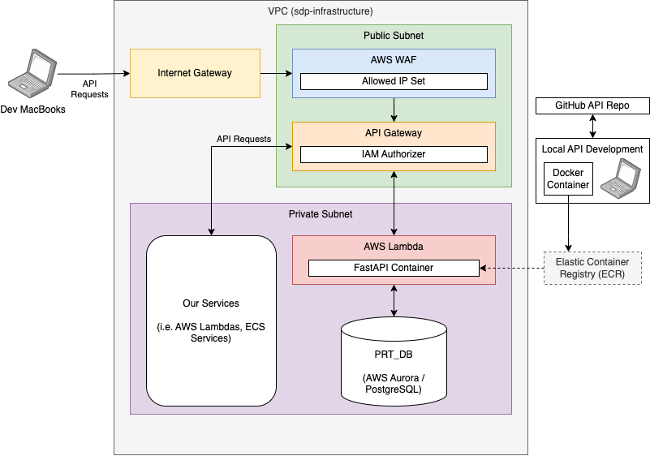

# Infrastructure

## Overview

This section covers the AWS infrastructure components used in the PRT API. All of these components are provisioned, configured and managed using Terraform, ensuring a consistent and repeatable deployment process.

Primary components include:

- AWS Lambda to run the FastAPI code.
- AWS API Gateway to route incoming traffic to the lambda.
- AWS WAF to restrict access to the API based on IP address.

## Architecture Diagram

## Component Overview

### Internet Gateway

Internet Gateway allows communication between instances in your VPC and the internet. It allows traffic in and out of the VPC. This component is provisioned by the Terraform within [sdp-infrastructure](https://github.com/ONS-Innovation/sdp-infrastructure).

### AWS WAF

AWS WAF (Web Application Firewall) protects the API Gateway by allowing or blocking requests based on defined rules. In this case, it restricts access to a specified list of IP addresses. This allows developers to whitelist their IP addresses within the IP Set to access the API during local development.

This component sits within the Public Subnet within the VPC. This is so that it can inspect incoming traffic from the internet before it reaches the API Gateway.

### API Gateway

API Gateway routes incoming traffic to the Lambda Function. This component is responsible for handling all API requests and responses, including request validation, transformation, and authorization.

As part of the API Gateway, IAM authorizers are used to control access to the API endpoints. This ensures that our services can only access the resources they require.

The API Gateway is also configured to be within the Public Subnet, allowing it to receive incoming traffic from the internet. Without this, the API Gateway would not be able to receive requests from our developer MacBooks.

### AWS Lambda

AWS Lambda is responsible for executing the FastAPI code in response to API Gateway events. It runs the application code in a serverless environment, automatically scaling to handle incoming requests.

Each time a request hits the API Gateway, the gateway will check for authentication. If authentication is successful, it will forward the API request to the Lambda function for FastAPI to handle. This does introduce a cold start latency, as the Lambda function may need to be initialized before it can process the request, but this is acceptable for our use case.

The lambda is setup with Security Groups so it has permissions to access the database ([PRT_DB](https://github.com/ONS-Innovation/keh-prt-db)).

## Usage

To give an idea of the route API requests make within our infrastructure, here are the 2 main processes below:

### 1. Local Development

During local development of our services, the API will need to be accessed by developers' local machines. This means that developers will not have to have the API and Database running locally, as they can interact with the deployed API in AWS (obviously using our dev environment).

These requests will follow a similar pattern to the production requests, going through the API Gateway and invoking the Lambda function, with a few extra steps to allow communication with the developer's local environment while maintaining security.

The request goes through the following steps:

1. Local service makes an API request to the deployed API (via the domain name).
2. Route53 resolves the domain name to the API Gateway's public IP address.
3. The request is routed to the API Gateway.
4. The WAF notices this request and intercepts it for inspection against the defined rules.
5. If the request came from an allowed IP address, it is forwarded to the API Gateway for further processing. Otherwise, it is blocked and a 403 Forbidden response is returned.
6. The API Gateway then checks the request header for the IAM credentials (If accessing a restricted endpoint).
7. If the IAM credentials are valid, the API Gateway forwards the request to the Lambda function for processing. If not, a 401 Unauthorized response is returned.
8. The Lambda function processes the request and interacts with the database as needed, returning the response to the API Gateway.
9. A response is sent back through the API Gateway, WAF, and Route53 to the local service.

### 2. AWS Service Usage

Services within AWS follow the same process but bypass the WAF inspection, as they are kept within the same VPC.

**Note:** This section will be fleshed out more once we have more details on the specific AWS services being used and their interactions with the API. I think we will probably have to allow communication between these services and the API Gateway using IAM permissions.
